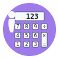
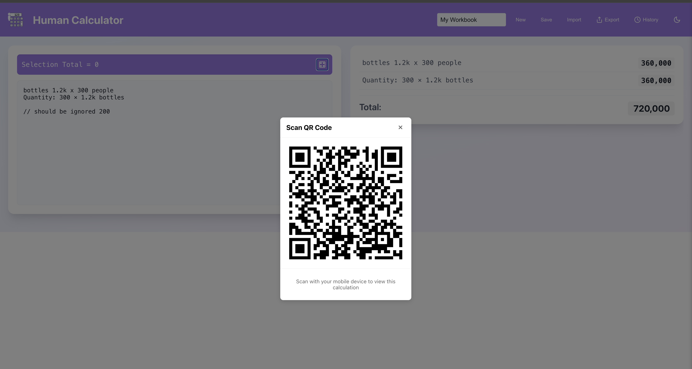

# Human Web Calculator



This easy-to-use web calculator lets you mix regular text with math problems in a natural way. Just type something like "Bottles 2 boxes @ 10k" and it automatically calculates 20,000. It works line by line, showing results for each line plus a grand total at the bottom. You can use simple or complex math expressions, and even highlight parts of your text to see quick calculations. Perfect for shopping lists, budgets, or any quick math needs. No internet needed - works 100% offline in your browser! ✈️

## 📸 Screenshot



## ✨ Features

**🔢 Core Calculation & Input:**

- **📝 Free-form Input:** Accepts a mix of text and arithmetic expressions in a flexible textarea.
- **📊 Line-by-Line Evaluation:** Processes calculations on each line, showing individual results.
- **💯 Live Total:** Displays a continuously updated overall sum of all calculations.
- **🏷️ Label Handling:** Intelligently processes lines with labels, extracting and calculating arithmetic parts (e.g., `tape (140*25)` will calculate `140*25`).
- **💬 Comment Support:** Lines starting with `//` are ignored, allowing for comments within the calculations.
- **🔍 Pattern Recognition:** Automatically recognizes and processes various text patterns:
  - Decimal with k/m suffix (e.g., "1.2k x 300")
  - Descriptive formats (e.g., "300 people × 1,200 bottles each")
  - Currency notations (e.g., "300 bottles @ UGX 1,200")
  - Percentage calculations
  - Fraction handling
- **🧹 Expression Sanitization:** Cleans up expressions to improve parsing reliability.

**🎨 User Interface & Experience:**

- **🌓 Dark Mode:** Toggle between light and dark themes for user comfort.
- **✏️ Selection Calculation:** Highlight any part of the text to see a calculation result for just the selected portion in a persistent banner.
- **📱 Responsive Design:** Adapts to different screen sizes for usability.
- **🔌 Offline Functionality:** Works completely offline with no internet connection required, with all calculations performed locally in the browser.

**📚 Workbook Management:**

- **✏️ Workbook Naming:** Set and change the name of the current workbook.
- **🆕 New Workbook:** Easily create a new, empty workbook.
- **💾 Save Workbook:** Save the current workbook (text, name) locally in the browser.
- **📂 Load Workbook:** Open previously saved workbooks.
- **📤 Import/Export Workbooks:** Import and export workbook data.

**📊 Data Handling & Sharing:**

- **📤 Export Results:** Export calculation results in various formats:
  - **📄 PDF:** Save calculations as a PDF document.
  - **📊 Excel (XLSX):** Export data to an Excel spreadsheet.
  - **🖼️ Image:** Capture and save the calculation area as an image.
- **⏱️ Calculation History:**
  - View a history of past calculations (up to 50 entries).
  - Save the current state (text, total, date) to history.
  - Load a calculation from history back into the main editor.
  - Delete entries from history.
- **📱 QR Code Generation:** Generate a QR code for the current selection or the entire workbook (including the total) for easy sharing or transfer.

**🛠️ Development & Setup:**

- 🔄 Built with React and Create React App.
- 📜 Includes scripts for starting, testing, and building the application.
- 🐳 Docker support for easy containerized deployment.

This project was bootstrapped with [Create React App](https://github.com/facebook/create-react-app).

## Available Scripts

In the project directory, you can run:

### `npm start`

Runs the app in the development mode.\
Open [http://localhost:3000](http://localhost:3000) to view it in your browser.

The page will reload when you make changes.\
You may also see any lint errors in the console.

### `npm test`

Launches the test runner in the interactive watch mode.\
See the section about [running tests](https://facebook.github.io/create-react-app/docs/running-tests) for more information.

### `npm run build`

Builds the app for production to the `build` folder.\
It correctly bundles React in production mode and optimizes the build for the best performance.

The build is minified and the filenames include the hashes.\
Your app is ready to be deployed!

See the section about [deployment](https://facebook.github.io/create-react-app/docs/deployment) for more information.

## 🐳 Running with Docker

1. **Build Docker image**

   ```bash
   docker build -t human-calculator .
   ```

2. **Run Docker container**

   ```bash
   docker run -p 7842:7842 human-calculator
   ```

3. **Open the app**

   Go to: [http://localhost:7842](http://localhost:7842)

> 💡 **Detached Mode**

```bash
docker run -d -p 7842:7842 --name my-human-calculator-app human-calculator
```

### `npm run eject`

**Note: this is a one-way operation. Once you `eject`, you can't go back!**

If you aren't satisfied with the build tool and configuration choices, you can `eject` at any time. This command will remove the single build dependency from your project.

Instead, it will copy all the configuration files and the transitive dependencies (webpack, Babel, ESLint, etc) right into your project so you have full control over them. All of the commands except `eject` will still work, but they will point to the copied scripts so you can tweak them. At this point you're on your own.

You don't have to ever use `eject`. The curated feature set is suitable for small and middle deployments, and you shouldn't feel obligated to use this feature. However we understand that this tool wouldn't be useful if you couldn't customize it when you are ready for it.

## Learn More

You can learn more in the [Create React App documentation](https://facebook.github.io/create-react-app/docs/getting-started).

To learn React, check out the [React documentation](https://reactjs.org/).

### Code Splitting

This section has moved here: [https://facebook.github.io/create-react-app/docs/code-splitting](https://facebook.github.io/create-react-app/docs/code-splitting)

### Analyzing the Bundle Size

This section has moved here: [https://facebook.github.io/create-react-app/docs/analyzing-the-bundle-size](https://facebook.github.io/create-react-app/docs/analyzing-the-bundle-size)

### Making a Progressive Web App

This section has moved here: [https://facebook.github.io/create-react-app/docs/making-a-progressive-web-app](https://facebook.github.io/create-react-app/docs/making-a-progressive-web-app)

### Advanced Configuration

This section has moved here: [https://facebook.github.io/create-react-app/docs/advanced-configuration](https://facebook.github.io/create-react-app/docs/advanced-configuration)

### Deployment

This section has moved here: [https://facebook.github.io/create-react-app/docs/deployment](https://facebook.github.io/create-react-app/docs/deployment)

### `npm run build` fails to minify

This section has moved here: [https://facebook.github.io/create-react-app/docs/troubleshooting#npm-run-build-fails-to-minify](https://facebook.github.io/create-react-app/docs/troubleshooting#npm-run-build-fails-to-minify)
